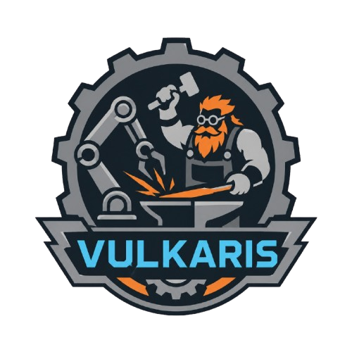
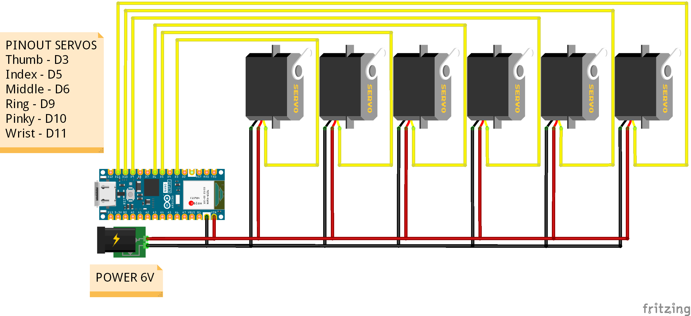

# InMoov Hub: Controle de Braço Robótico com Visão Computacional

<p align="center">
  
</p>

<p align="center">
  <strong>Painel de Controle Biométrico e Rastreamento de Mãos em Tempo Real</strong>
</p>

<p align="center">
  
  
  
  
  
</p>

---

## 📖 Sobre o Projeto

O **InMoov Hub** é um sistema avançado desenvolvido para controlar um braço robótico (baseado no design humanoide InMoov) de forma totalmente sem fio e em tempo real. Utilizando apenas uma webcam, o sistema lê os movimentos da mão humana, processa os dados via Inteligência Artificial e os transmite instantaneamente para um microcontrolador **ESP32** via **Bluetooth Low Energy (BLE)**.

Recentemente, o projeto evoluiu de um simples script para uma arquitetura moderna dividida entre um **Frontend em React** (Painel de Controle) e um **Backend em FastAPI**.

---

## 🌟 Principais Recursos

- 🖐️ **Rastreamento de Mãos e Pulso:** Desenho em tempo real das conexões na mão e rastreamento do movimento do pulso. Agora suporta tanto a **palma** quanto o **dorso da mão**, evitando perdas de tracking se a mão for virada!
- ⚡ **Comunicação WebSockets:** Transmissão de vídeo e biometria em alta velocidade (~30 FPS) entre o servidor Python e o dashboard web.
- 🎨 **Painel "Glassmorphism":** Interface super moderna feita em React com efeitos translúcidos e design futurista inspirado em Sci-Fi.
- 🛜 **Controle BLE Sem Fio:** Envio instantâneo dos comandos motores do PC direto para a placa ESP32.
- 🛡️ **Segurança de Gestos:** Bloqueio automático de gestos inapropriados.

---

## 🏗️ Arquitetura do Sistema

### 1. Frontend (React + Vite)
- Dashboard biométrico elegante.
- Mostra qual mão (`MÃO DIREITA` ou `MÃO ESQUERDA`) foi detectada pelo sistema.
- Exibe o status da conexão BLE com o braço, o ping de FPS da câmera e os dados da mão sendo transmitidos (`$XXXXX`).

### 2. Backend (FastAPI + OpenCV + Bleak)
- Roda no arquivo `app.py`.
- **MediaPipe / CVZone:** Responsável pela análise dos *landmarks* da mão do usuário. Lógica customizada matemática para identificar flexões de dedo em qualquer orientação da mão.
- **Bleak:** Biblioteca Python que varre o ambiente em busca da ESP32 chamada `InMoov_Hand` e estabelece a conexão remota.

### 3. Hardware (ESP32 + Servomotores)
- Código em C++ (`inmoov_hand.ino`) que atua como servidor BLE.
- Assim que o ESP32 recebe a string de posições, ele traduz os "0"s e "1"s para ângulos de atuação dos 5 servomotores independentes, abrindo e fechando cada um dos dedos de acordo com a sua mão em tempo real.

---

## 📂 Estrutura de Pastas

O repositório está organizado da seguinte forma:

- 📂 arquivos_2d: Contém os arquivos vetoriais em 2D (ex: o desenho `box_inmoov.dxf` para corte a laser da caixa dos componentes).
- 📂 arquivos_3d: Contém todos os arquivos STL para a impressão 3D das peças da mão robótica (como dedos, punho e suportes), do projeto de hardware aberto [InMoov](https://inmoov.fr).
- 📂 esquematico: Contém o esquema elétrico de ligação (`Inmoov_esquematico.png`) para montagem do circuito eletrônico do projeto.
- 📂 frontend: Código fonte da interface web (dashboard) desenvolvida em React + Vite.
- 📂 inmoov_hand: Contém o código C++ (`inmoov_hand.ino`) para gravação na placa ESP32, responsável pelo controle dos servomotores via BLE.
- 📄 app.py: Arquivo principal do backend em FastAPI que realiza a captura da câmera, processamento de visão computacional (MediaPipe) e envio de dados da mão.


---

## 🔌 Esquemático e Lista de Materiais

### Esquemático de Ligação


### Lista de Materiais
- Arduino Nano ESP32
- Fio de Nylon 0.8mm
- 6 Servo Motores JX PDI 6221MG (ou similar)
- Fonte 6V 3A (ou maior)
- Interruptor
- LED 5mm
- Resistor 1K ohm
- Jumpers
- Peças Corte a Laser
- Peças Impressas 3D

---

## 🚀 Como Executar

### Pré-requisitos
- Python 3.10+
- Node.js e NPM
- Uma webcam conectada
- ESP32 ligada e executando o código `.ino`

### Upload do Código para a ESP32
1. Abra o arquivo `inmoov_hand/inmoov_hand.ino` na Arduino IDE.
2. Conecte a placa ESP32 ao seu computador via cabo USB.
3. Na Arduino IDE, selecione a placa correspondente (ex: Arduino Nano ESP32) e a porta correta.
4. Clique em "Carregar" (Upload) para gravar o código no microcontrolador.
5. Após o carregamento, a ESP32 estará pronta para receber a conexão via Bluetooth.

### Backend (Processamento e IA)
```bash
# Ative seu ambiente virtual (se aplicável)
# .venv\Scripts\activate

# Instale os requerimentos
pip install -r requirements.txt

# Inicie o servidor FastAPI (a câmera será aberta)
python app.py
```

### Frontend (Dashboard UI)
```bash
cd frontend
npm install
npm run dev
```
Abra o navegador no endereço local fornecido (geralmente `http://localhost:5173`) para visualizar o Painel Hub.

---

## 🛠️ Tecnologias e Ferramentas

 <div style="display=inline-block; margin-top: 10px;">
    &nbsp;
    &nbsp;
    &nbsp;
    &nbsp;
    &nbsp;
 </div>